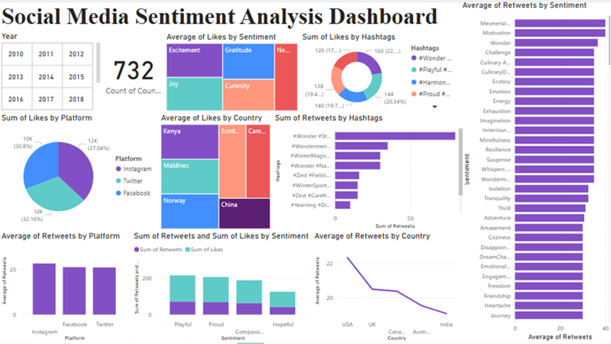

# Social-Media-Sentiment-Analysis-Dashboard

A Power BI dashboard, developed as a part of **4-week virtual internship on AI and Data Analytics with focus on Green skills organized by AICTE, Shell India and Edunet Foundation under the Skills4Future Program**, analyzes sentiment distribution, engagement metrics, and trending hashtags across platforms like Facebook, Instagram, and Twitter.
Built using a Kaggle dataset containing over 50,000 social media records including likes, retweets, sentiment scores, hashtags, and country-wise engagement data.
The dashboard helps identify platform-wise engagement patterns, sentiment impact, and top-performing content for data-driven social media strategy.

## Dashboard

